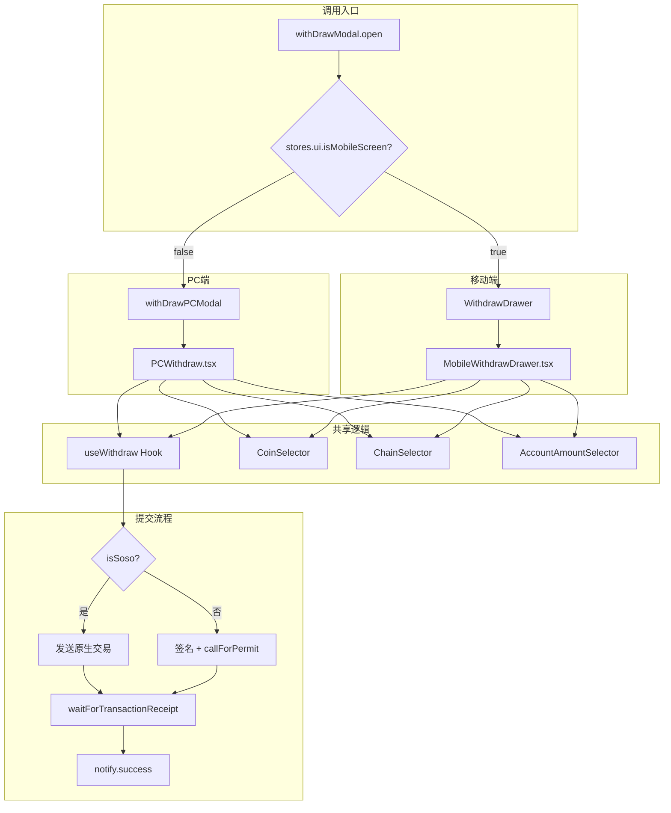

# 移动端 Withdraw Drawer 实现

**日期**: 2026-01-06  
**需求**: 为 Withdraw 组件新增移动端样式

---

## 需求背景

为现有的 PC 端 Withdraw 组件添加移动端适配，实现响应式设计。移动端使用底部抽屉（Drawer）形式展示。

---

## 核心流程图



---

## 文件结构

```
src/pages/_components/withdraw/
├── index.tsx                    # 设备自适应入口（新建）
├── PCWithdraw.tsx              # PC端组件（原 index.tsx 重命名）
├── mobile/
│   └── MobileWithdrawDrawer.tsx # 移动端组件（新建）
├── schema.ts                    # 表单验证 Schema
├── TransferProcess.tsx          # 转账进度组件
└── AccountAmountSelector.tsx    # 账户金额选择器

src/components_tw/
├── drawers/index.tsx            # 注册 WithdrawDrawer
└── modals/spot/index.tsx        # withDrawModal 设备判断
```

---

## 关键变更

### 1. 设备自适应入口 (`index.tsx`)

```typescript
export const withdrawModal = {
  open: (props?) => {
    if (stores.ui.isMobileScreen) {
      WithdrawDrawer.open(props);
    } else {
      withDrawPCModal.open(props);
    }
  },
  close: () => { /* 同上 */ },
};
```

### 2. Drawer 注册 (`drawers/index.tsx`)

```typescript
export const WithdrawDrawer = createSwipeAbleDrawer({
  Component: MobileWithdrawDrawer,
  options: {
    anchor: "bottom",
    HeaderComponent: null,  // 组件内部渲染标题
  },
});
```

### 3. 移动端组件特性

- 底部 Drawer 形式
- 自定义头部（标题 + 关闭按钮同行对齐）
- 复用 PC 端所有业务逻辑
- 复用 CoinSelector、ChainSelector 等共享组件
- 使用 react-hook-form 管理表单状态

---

## 调用点

所有现有调用点无需修改，`withDrawModal` 自动适配设备：

| 调用位置 | 说明 |
|---------|------|
| `spot/main/position/tab/asset` | 资产列表提现按钮 |
| `spot/main/asset/actions` | 资产操作按钮 |
| `account/assets/components/btnNav` | 账户资产导航按钮 |
| `spot/main/position/tab/transferHistory` | 转账历史提现按钮 |

---

## Figma 设计稿

- 移动端设计稿: https://www.figma.com/design/Azo4rMd3WrDbldUXz8cqng/SoDEX?node-id=20433-287557&m=dev

---

## 检查结果

- ✅ 功能完整：所有 PC 端功能已同步至移动端
- ✅ 代码质量：Lint 检查通过，无错误
- ✅ 性能优化：使用 useMemo、useCallback
- ✅ 向后兼容：现有调用点无需修改

