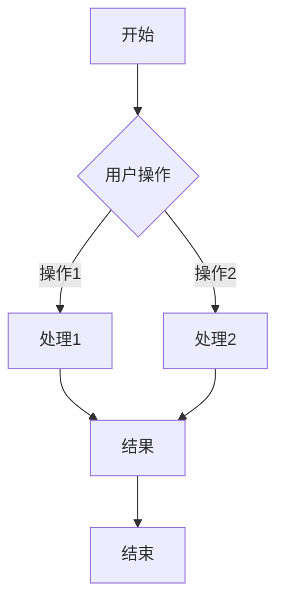
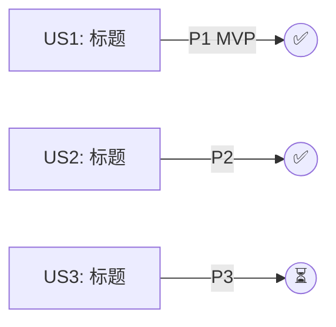
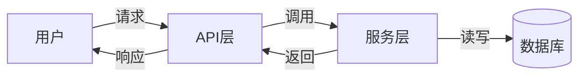

# 需求流程图: [功能名称]

**最后更新**: [YYYY-MM-DD] | **版本**: v1.0

---

## 功能流程

```mermaid
flowchart TD
    A[开始] --> B{用户操作}
    B -->|操作1| C[处理1]
    B -->|操作2| D[处理2]
    C --> E[结果]
    D --> E
    E --> F[结束]
```

---

## 用户故事状态

```mermaid
graph LR
    US1[US1: 标题] -->|P1 MVP| Done1((✅))
    US2[US2: 标题] -->|P2| Done2((✅))
    US3[US3: 标题] -->|P3| Pending3((⏳))
```

---

## 数据流

```mermaid
flowchart LR
    User[用户] --> |请求| API[API层]
    API --> |调用| Service[服务层]
    Service --> |读写| DB[(数据库)]
    Service --> |返回| API
    API --> |响应| User
```

---

## 更新记录

| 版本 | 日期 | 变更 |
|------|------|------|
| v1.0 | [日期] | 初始版本 |

